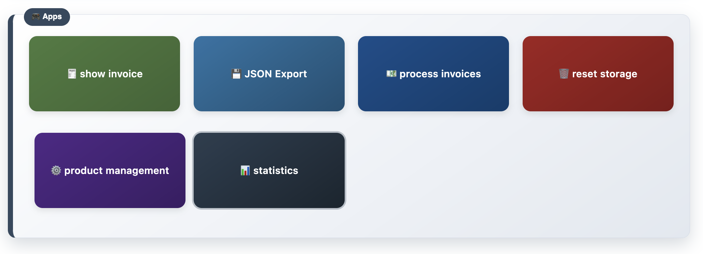

# 🍕 Mini ERP System

Ein intelligentes Kassensystem für Einzelunternehmer, das eine umfassende Verwaltung von Bestellungen, Kunden und Produkten ermöglicht. Dieses System bietet eine benutzerfreundliche Oberfläche zur Verwaltung von Bestellungen, Rechnungen und Produktpreisen sowie eine Visualisierung von wirtschaftlichen Kennzahlen in Echtzeit als On-Premise Anwendung.




## 📋 Inhaltsverzeichnis

- [✨ Funktionen](#-funktionen)
- [⚙️ Installation](#️-installation)
- [🚀 Verwendung](#-verwendung)
- [💻 Technologien](#-technologien)
- [🤝 Mitwirken](#-mitwirken)
- [📜 Lizenz](#-lizenz)

## ✨ Funktionen

- **👤 Nutzerverwaltung**: Hinzufügen und Wechseln von Nutzern.
- **🛒 Bestellverwaltung**: Erstellen, Bearbeiten und Löschen von Bestellungen.
- **🧾 Rechnungsverwaltung**: Anzeigen und Drucken von Rechnungen.
- **📦 Produktmanagement**: Hinzufügen, Bearbeiten und Löschen von Produkten.
- **📊 Statistiken**: Anzeige von Umsatz- und Gewinnstatistiken.
- **🔍 Suchfunktion**: Suchen nach Kunden und Bestellungen.
- **📱 Responsive Design**: Optimiert für verschiedene Bildschirmgrößen.

## ⚙️ Installation

1. **Repository klonen**:
   ```bash
   git clone https://github.com/p4nda7/miniERP.git
   ```

2. **In das Verzeichnis wechseln**:
   ```bash
   cd miniERP
   ```

3. **Öffnen Sie die `index.html` in Ihrem bevorzugten Webbrowser**.
    ```bash
   open index.html
   ```

## 🚀 Verwendung

1. **👤 Nutzer hinzufügen**:
   - Geben Sie den Namen des Nutzers ein und klicken Sie auf "Start Order".

2. **🛒 Bestellung hinzufügen**:
   - Wählen Sie die Pizzasorte und Menge aus, geben Sie den Verkaufspreis ein und klicken Sie auf "Add Position".

3. **✅ Bestellung abschließen**:
   - Klicken Sie auf "Close Order", um die Bestellung abzuschließen und eine Rechnung zu generieren.

4. **🧾 Rechnungen anzeigen**:
   - Klicken Sie auf "Show Invoice", um die Rechnungsübersicht zu öffnen.

5. **⚙️ Produktmanagement**:
   - Klicken Sie auf "Product Management", um Produkte hinzuzufügen oder zu bearbeiten.

6. **📊 Statistiken anzeigen**:
   - Klicken Sie auf "Statistics", um Umsatz- und Gewinnstatistiken anzuzeigen.

## 💻 Technologien

- **HTML5**: Strukturierung der Webanwendung.
- **CSS3**: Styling und Layout.
- **JavaScript**: Interaktive Funktionen und Logik.
- **LocalStorage**: Speicherung von Bestell- und Produktdaten.

## 🤝 Mitwirken

Beiträge sind willkommen! Bitte erstellen Sie einen Fork des Repositories und senden Sie einen Pull-Request mit Ihren Änderungen.

1. Forken Sie das Projekt.
2. Erstellen Sie einen neuen Branch (`git checkout -b feature/NeuesFeature`).
3. Committen Sie Ihre Änderungen (`git commit -m 'Füge ein neues Feature hinzu'`).
4. Pushen Sie den Branch (`git push origin feature/NeuesFeature`).
5. Erstellen Sie einen Pull-Request.

## 📜 Lizenz

Dieses Projekt ist unter der MIT-Lizenz lizenziert. Weitere Informationen finden Sie in der [LICENSE](LICENSE) Datei.
